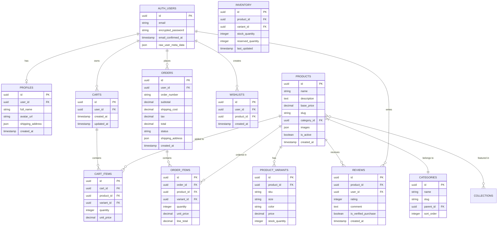

# Mermaid Diagrams for Portfolio Projects

This file contains all Mermaid diagram codes for generating architecture diagrams for Ghana ERP and Pee N Kay projects.

---

## 🏢 Ghana ERP Diagrams

### 1. System Architecture Diagram


### 2. Multi-Tenant Data Flow


### 3. Event-Driven Communication


### 4. Database Schema (Entity Relationship)


### 5. Type-Safe API Development Flow


---

## 🛒 Pee N Kay E-Commerce Diagrams

### 1. System Architecture Diagram


### 2. Authentication Flow


### 3. Real-Time Inventory Synchronization


### 4. Shopping Cart & Checkout Flow


### 5. Server Components vs Client Components Architecture


### 6. Database Schema (Entity Relationship)



---

## 📝 How to Use These Diagrams

### Online Mermaid Editors:
1. **Mermaid Live Editor**: https://mermaid.live/
   - Copy any diagram code above
   - Paste into the editor
   - Export as PNG/SVG

2. **GitHub Markdown**: 
   - GitHub natively supports Mermaid in markdown
   - Simply paste the code block with ` ```mermaid ` in your README

3. **VS Code Extension**:
   - Install "Markdown Preview Mermaid Support" extension
   - View diagrams directly in VS Code preview

### Export Tips:
- **PNG**: Best for embedding in READMEs (transparent background)
- **SVG**: Best for high-resolution, scalable diagrams
- **PDF**: Best for documentation

### Customization:
- Colors can be adjusted using `style` declarations at the end of each diagram
- Node shapes can be changed: `[]` (rectangle), `()` (rounded), `{}` (rhombus), `((()))` (circle)
- Arrow types: `-->` (solid), `-.->` (dotted), `==>` (thick)

---

## 🎨 Color Scheme Guide

### Ghana ERP:
- **Frontend**: `#61dafb` (React Blue)
- **Backend**: `#e0234e` (NestJS Red)
- **Database**: `#336791` (PostgreSQL Blue)
- **Cache**: `#dc382d` (Redis Red)
- **Monitoring**: `#f46800` (Grafana Orange)

### Pee N Kay:
- **Next.js**: `#000000` (Black)
- **Supabase**: `#3ecf8e` (Supabase Green)
- **Edge/CDN**: `#ff6b6b` (Red)
- **Server Components**: `#87ceeb` (Light Blue)
- **Client Components**: `#ffa07a` (Light Salmon)

---

## ✅ Checklist

- [ ] Copy diagram codes to Mermaid Live Editor
- [ ] Customize colors if needed
- [ ] Export as PNG with transparent background
- [ ] Save to appropriate directory:
  - Ghana ERP: `/projects-showcase/ghana-erp/diagrams/`
  - Pee N Kay: `/projects-showcase/pee-n-kay/diagrams/`
- [ ] Embed images in respective README files
- [ ] Test diagram rendering in GitHub preview

---

**Note**: These diagrams are designed to be comprehensive yet clear. Feel free to simplify them based on your specific needs or the level of detail you want to showcase in your portfolio.
