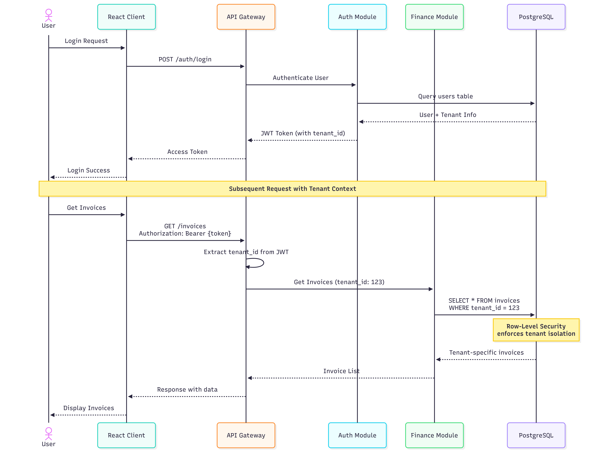
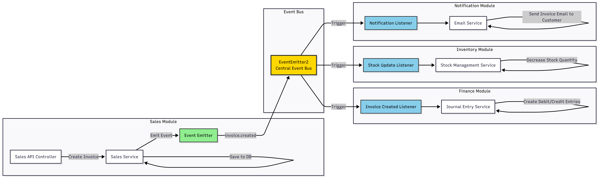
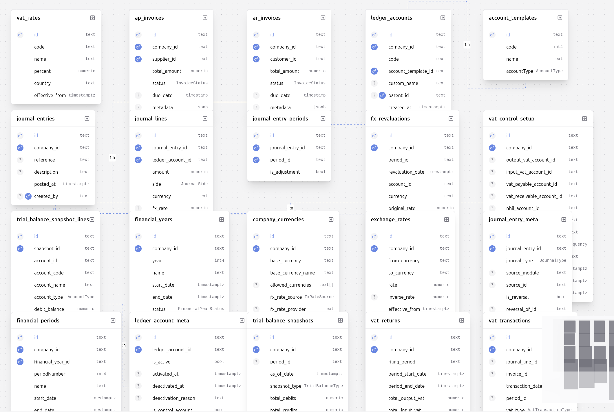
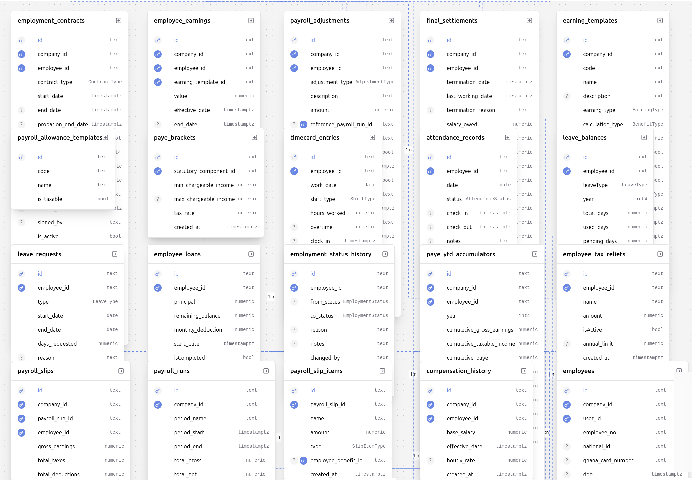
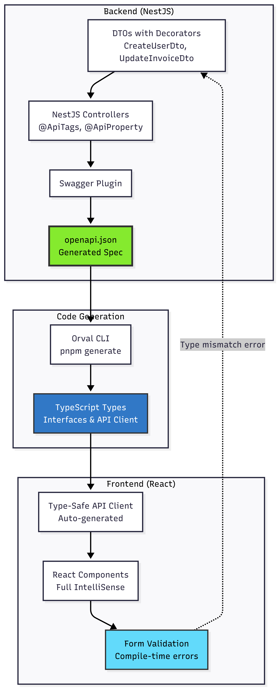
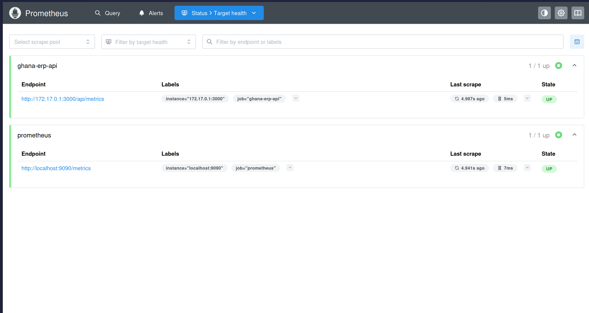
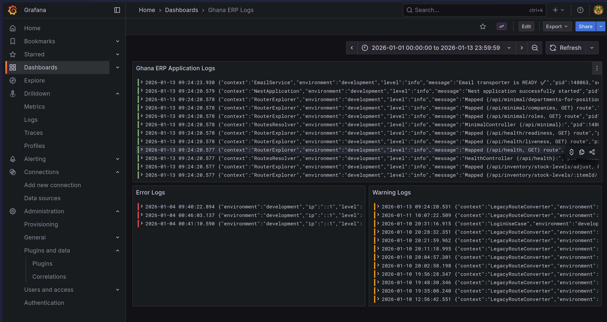

# Ghana ERP - Enterprise Resource Planning Platform

> A production-grade, multi-tenant ERP system architected for horizontal scalability and regulatory compliance in emerging markets

## Executive Summary

Ghana ERP is a comprehensive enterprise resource planning platform engineered to solve the complex challenge of business process digitization across multiple organizational tenants. The system addresses critical pain points in financial management, inventory control, human resources, procurement, and regulatory compliance—specifically designed for jurisdictions requiring strict audit trails and e-VAT integration.

Built on a **microservices-oriented monorepo architecture**, this platform demonstrates advanced software engineering patterns including domain-driven design (DDD), event-driven architecture (EDA), and robust multi-tenancy at the database level. The system is designed for **horizontal scaling**, enabling the platform to serve thousands of concurrent users across isolated tenant contexts without data leakage or performance degradation.

---

## System Architecture

**Architecture Diagrams (Draw.io & exported images)**

Diagrams for Ghana ERP are available in the Draw.io file: [Ghana ERP Diagrams - Draw.io](https://drive.google.com/file/d/1FtMUtqF33-xPjxBSxLvFyzylhNuviUJ3/view?usp=sharing)

Exported images (committed to this repo under `./assets/`):

**Multi-tenant Data Flow**

**Event-Driven Communication**

**Database Schemas (Finance / HR)**

**Type-safe API Development Flow**

**Observability Dashboards**

How to view: Open the Draw.io link or view the exported images in `./assets/` (PNG). If you want different sized exports or SVGs, I can generate and add them to `/projects-showcase/ghana-erp/diagrams/` — tell me which formats you prefer.
---

## Core Technical Features

### 🏗️ Multi-Tenant Architecture
- **Tenant Isolation Strategy**: Implements schema-based multi-tenancy using Prisma with PostgreSQL's row-level security (RLS)
- **Context Propagation**: Tenant ID injected via custom decorators and maintained throughout the request lifecycle
- **Data Segregation**: Zero cross-tenant data leakage through database-level constraints and application-layer guards

### 📊 Type-Safe API Layer
- **Contract-First Development**: OpenAPI specification generated from NestJS decorators
- **Client Generation**: Orval auto-generates TypeScript clients with full type inference from OpenAPI spec
- **Schema Validation**: Zod integration for runtime type validation at API boundaries
- **End-to-End Type Safety**: From database schema → API response → frontend components

### 🎯 Domain-Driven Design (DDD)
- **Bounded Contexts**: Each business module (Finance, HR, Inventory, etc.) operates as an independent bounded context
- **Separation of Concerns**: Clear boundaries enforced via ESLint plugin-boundaries
- **Event-Driven Communication**: Modules communicate via domain events using NestJS EventEmitter2

### ⚡ Performance Optimization
- **Distributed Caching**: Redis-based caching layer with configurable TTLs
- **Query Optimization**: Prisma query batching and connection pooling
- **Background Jobs**: BullMQ for asynchronous task processing (email notifications, report generation)
- **Database Indexing**: Strategic indexes on frequently queried columns

### 📦 Monorepo Architecture
- **Turborepo**: Optimized build system with intelligent caching and parallel execution
- **pnpm Workspaces**: Efficient dependency management with shared packages
- **Modular Packages**: Reusable packages for authentication, database, observability, pagination, etc.

### 🔍 Observability & Monitoring
- **Metrics**: Prometheus integration for API metrics, request latency, and resource utilization
- **Logging**: Centralized logging with Loki (structured JSON logs)
- **Dashboards**: Grafana dashboards for real-time monitoring
- **Health Checks**: `/health` endpoint with database connectivity and service status

### 🌐 Regulatory Compliance
- **E-VAT Integration**: Compliance module for Ghana Revenue Authority's electronic VAT system
- **Audit Logs**: Immutable audit trail for all financial transactions
- **Data Retention**: Configurable retention policies for compliance requirements

---

## Database Schema & Data Management Strategy

### Persistence Layer Architecture

The system employs a **single-database, multi-schema approach** using PostgreSQL with Prisma ORM. This design balances operational simplicity with robust tenant isolation.

#### Database Schema Diagrams

The core database schemas have been exported from the Draw.io file and added to the repository under `./assets/`.

**Finance Schema**

**HR Schema**

If you'd like a consolidated ER diagram (all domains in one view) or an SVG export, tell me and I will generate and commit it to `/projects-showcase/ghana-erp/diagrams/`.
---

## Functional Walkthrough

> 🎥 **Video/GIF Placeholders** - Record the following sequences to demonstrate production-level functionality:

### 1. Multi-Tenant Onboarding Flow
**What to record:**
- Admin creates a new tenant organization
- System auto-generates tenant-specific schema/namespace
- First user registration and role assignment
- Dashboard shows tenant-isolated data

**Technical highlight:** Demonstrate that users from Tenant A cannot access Tenant B's data

---

### 2. Type-Safe API Development Workflow
**What to record:**
- Make a change to a NestJS DTO
- Run `pnpm openapi` to regenerate OpenAPI spec
- Run `pnpm generate` (Orval) to update frontend types
- Show TypeScript IntelliSense catching type errors in frontend code

**Technical highlight:** End-to-end type safety from database → API → frontend

### 4. Inventory Management
**What to record:**
- Add new product to catalog
- Record stock receipt from supplier
- Process a sale that decrements inventory
- View low-stock alerts
- Generate inventory valuation report

**Technical highlight:** Real-time inventory tracking across warehouses

---

### 5. RBAC & Permissions System
**What to record:**
- Login as Admin user → full access to all modules
- Login as Accountant → access only to Finance module
- Login as Warehouse Manager → access only to Inventory
- Attempt unauthorized action → show 403 Forbidden response

**Technical highlight:** Fine-grained role-based access control

---

### 6. Observability Dashboard
**What to record:**
- Open Grafana dashboard showing API metrics
- Trigger high load (simulate 100 concurrent requests)
- Show request latency graphs, error rates
- Demonstrate Loki logs filtered by tenant ID
- Show health check endpoint status

**Technical highlight:** Production-ready monitoring and alerting

---

## Tech Stack

| **Category**              | **Technology**                     | **Purpose**                                                  |
|---------------------------|------------------------------------|--------------------------------------------------------------|
| **Backend Framework**     | NestJS 11                          | Enterprise Node.js framework with TypeScript-first design    |
| **API Documentation**     | Swagger/OpenAPI 3.0                | Contract-first API development                               |
| **Type Generation**       | Orval                              | Auto-generate TypeScript clients from OpenAPI               |
| **Runtime Validation**    | Zod + class-validator              | Schema validation at API boundaries                          |
| **ORM**                   | Prisma 7                           | Type-safe database client with migration management         |
| **Database**              | PostgreSQL 16                      | ACID-compliant relational database                           |
| **Caching**               | Redis 7                            | Distributed caching and session storage                      |
| **Message Queue**         | BullMQ                             | Background job processing                                    |
| **Authentication**        | Passport.js + JWT                  | Stateless authentication with token-based auth               |
| **Authorization**         | Custom RBAC                        | Role-based access control with decorators                    |
| **Frontend Framework**    | React 19 + Vite                    | Modern UI with Fast Refresh and optimized bundling          |
| **State Management**      | TanStack Query (React Query)       | Server state management with caching and invalidation        |
| **UI Components**         | Custom component library           | Reusable design system components                            |
| **Monorepo Tool**         | Turborepo                          | High-performance build system                                |
| **Package Manager**       | pnpm                               | Fast, disk space efficient package manager                   |
| **Code Quality**          | ESLint + Prettier + Husky          | Linting, formatting, and pre-commit hooks                    |
| **Observability**         | Prometheus + Grafana + Loki        | Metrics collection, visualization, and log aggregation       |
| **Health Checks**         | NestJS Terminus                    | Readiness and liveness probes                                |
| **Email Service**         | Nodemailer                         | Transactional email delivery                                 |
| **Testing**               | Jest + Supertest                   | Unit and integration testing                                 |
| **CI/CD**                 | GitHub Actions                     | Automated testing and deployment pipelines                   |

---

